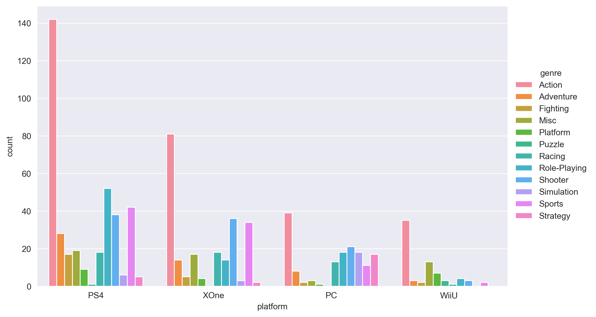

### Now we shall start getting ready for our project of creating this table: 

### However, before doing this project, we shall start by making simple and a bit easy task of creating this one:

### Which is data of PS3 when the game was released and number of users by the year of 2014,2015 and 2016 from the `dataset.csv`
### There are several steps to create such bar chart of PS3:
1. Read data and make dataframe of counted values
2. Then make sure that you have data of 'PS3' only
3. Create Figure of 8 by 6 and set style to `'darkgrid'`
4. Bar plot the data with `data,x,y` and `hue` and with 1.0 saturation
5. Put legend with no frame and move it out of the plot to outside
6. Save figure as `pre_project.png` file with tight bound box and dpi resolution as 150
7. Check whether the tables look alike

### Note that these are not all the steps of creating this plotting, so you shall think of other steps as well by looking at the 'Before_project.png' which is on this description and on files
##### If it is hard for you to understand, you may look for my solution by peeking and understand the logic, then try it for yourself