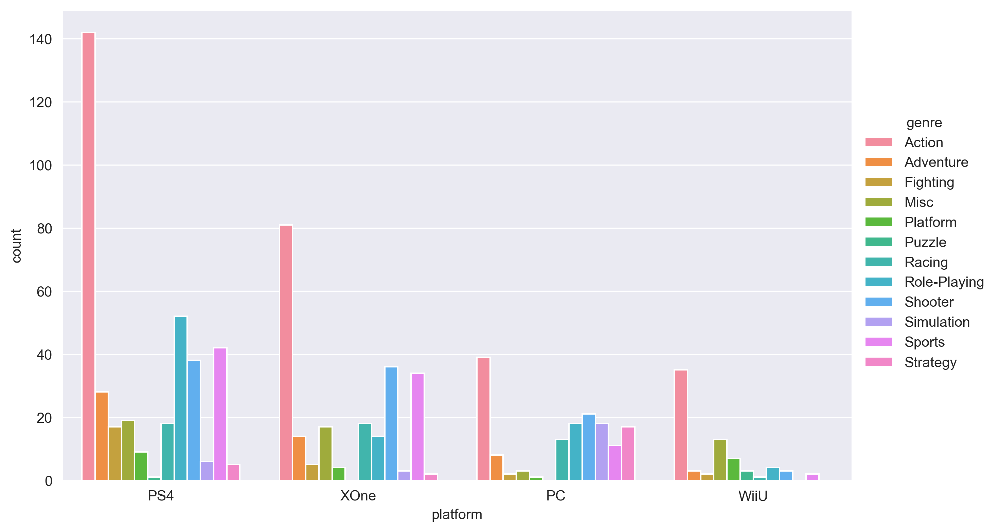
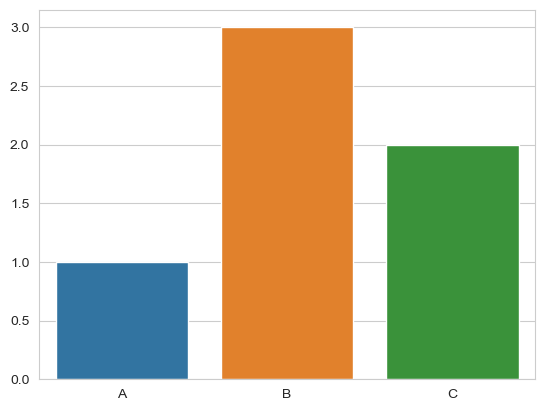
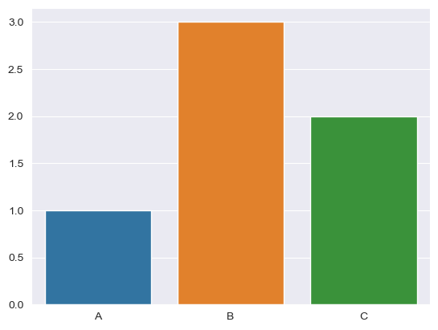
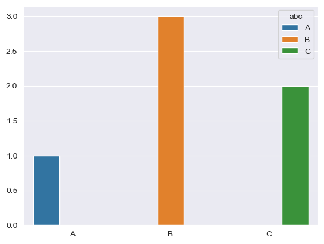
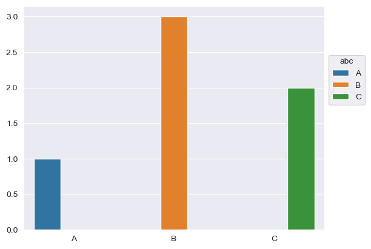
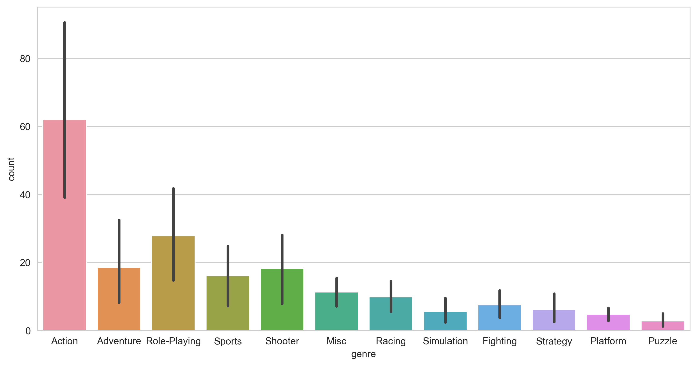

# Working with `seaborn` library

## Now we will be learning about last library `seaborn` with a bit of `matplotlib.pyplot` library

These libraries will help us construct the bar chart like our target: 

Starting with `seaborn` library:  

#### We are gonna use these functions:
`seaborn.barplot(data=None, *, x=None, y=None, hue=None, order=None, hue_order=None, estimator='mean', errorbar=('ci', 95), n_boot=1000, seed=None, units=None, weights=None, orient=None, color=None, palette=None, saturation=0.75, fill=True, hue_norm=None, width=0.8, dodge='auto', gap=0, log_scale=None, native_scale=False, formatter=None, legend='auto', capsize=0, err_kws=None, ci=<deprecated>, errcolor=<deprecated>, errwidth=<deprecated>, ax=None, **kwargs)` as you can see there are a lot of parameters for plotting bar chart in seaborn, but we will use only a few of them like: 
-`data` = *dataDataFrame, Series, dict, array, or list of arrays* which is dataset to plot  
-`x,y,hue` = names of variables in `data` which are the inputs for plotting long-form data 
-`saturation` = float for setting saturation of the plotting chart 
More on [seaborn manual](https://seaborn.pydata.org/index.html) 
 
`seaborn.set_style(style=None, rc=None)`
to set style where  
-`style` = *dict,or one of {darkgrid,whitegrid,dark,white,ticks}* for styling and   
-`rc` = *dict,optional* for overriding the values in the present seaborn style dictionaries. 
 
Ex: 
`sns.set_style("whitegrid")` 
`sns.barplot(x=["A", "B", "C"], y=[1, 3, 2])` 
 
Or 
`sns.set_style("darkgrid")` 
`sns.barplot(x=["A", "B", "C"], y=[1, 3, 2])` 
 

`matplotlib.axes.Axes.legend(title, frameon, *args, **kwargs)` 
-`title` = *str* to name the title of legend 
-`frameon` = boolean, whether to have frame on the legend or not 
-[other arguments](https://matplotlib.org/stable/api/_as_gen/matplotlib.axes.Axes.legend.html#matplotlib.axes.Axes.legend) 
This is used to plot legends which describe the bars of our chart. 
Don't be scared of this function, as you can see we need `matplotlib.axes.Axes` type data for using `legend()` function and it can be succeeded by doing so 
`sns.set_style("darkgrid")` 
`plot = sns.barplot(x=["A", "B", "C"], y=[1, 3, 2],hue = ["A", "B", "C"])` 
`plot.legend(title="abc")` 

### Always remember to use `hue` parameter in sns.barplot() for the next showing function of `plot.legend()` to work 

`seaborn.move_legend(obj, loc, bbox_to_anchor, **kwargs)` to move legend 
-`obj` = *object with the plot*  
-`loc` = *string or int* from {'upper left' or 2, 'upper right' or 1, 'lower left' or 3, 'lower right' or 4, 'upper center' or 9, 'lower center' or 8, 'center left' or 6, 'center right' or 7, 'center' or 10, 'best' or 0} 
-`bbox_to_anchor` = *BboxBase, 2-tuple, or 4-tuple of floats* to allow arbitrary placement of the legend 
`**kwargs` can be seen in [manual](https://seaborn.pydata.org/generated/seaborn.move_legend.html#seaborn.move_legend) 

Ex: 
`sns.set_style("darkgrid")` 
`plot = sns.barplot(x=["A", "B", "C"], y=[1, 3, 2],hue = ["A", "B", "C"])` 
`plot.legend(title="abc")` 
`sns.move_legend(plot,loc=0,bbox_to_anchor=(1,0.8))` 

  
To create new figure, or activate an existing one we use this function, but we will not consider all parameters: 
`matplotlib.pyplot.figure(num=None, figsize=None, dpi=None, *, facecolor=None, edgecolor=None, frameon=True, FigureClass=<class 'matplotlib.figure.Figure'>, clear=False, **kwargs)`  
-`figsize`= *(float, float), default: rcParams["figure.figsize"] (default: [6.4, 4.8])* which are width, height in inches 
 
After creating a figure we shall save it, there are several ways to do so, but we gonna use 
`matplotlib.figure.Figure.savefig(fname, *, transparent=None, dpi='figure', format=None, metadata=None, bbox_inches=None, pad_inches=0.1,facecolor='auto', edgecolor='auto', backend=None,**kwargs)` for which we will fill only a few of parameters like: 
-`fname` = *str or path-like or binary file-like* filled like "savename.format" for the name and format of saving 
-`dpi` = *float or 'figure', default: rcParams["savefig.dpi"] (default: 'figure')* to set resolution in dots per inch. 
-`bbox_inches` = *str or Bbox, default: rcParams["savefig.bbox"] (default: None)* to bound box in inches,but if *'tight'*, try to figure out the tight bbox of the figure.  

Ex: 
`plt.figure(figsize=(12,6))` 
`plotting_data = sns.barplot(otherinfo,x='genre',y='count')` 
`figure_plot = plotting_data.get_figure()` 
`figure_plot.savefig("Task1.png",dpi=300,bbox_inches = 'tight')` 

  
### Now, after learning and getting used to these functions, we may start testing ourselves by doing tasks on those functions.